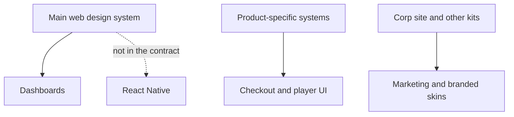
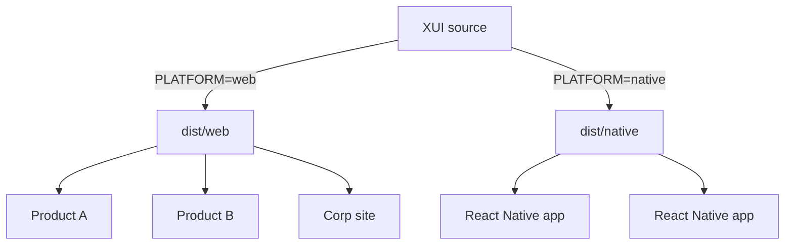
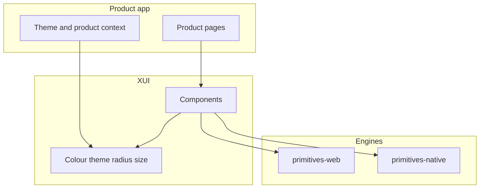
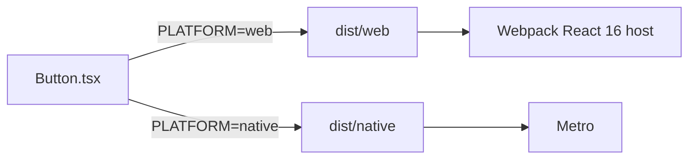
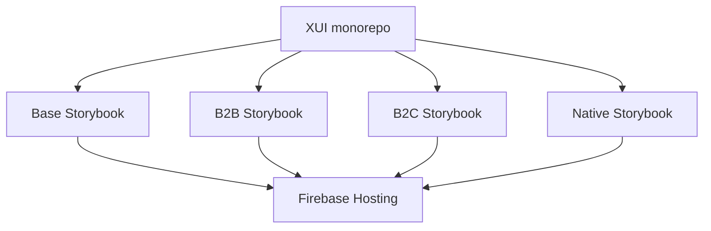
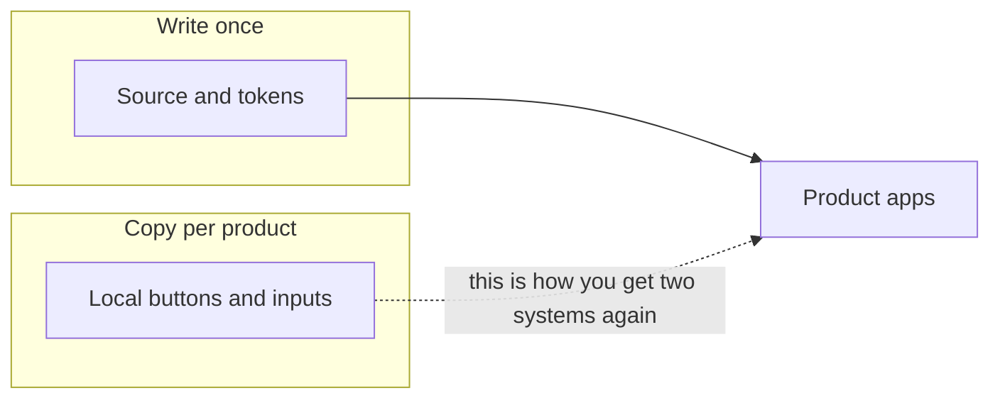

# One design system. Every product. Web and native.

For several years, the company did not have a design system. It had **design systems**.

There was a main one — the library most product web apps imported. Then there were product-specific systems, because a merchant dashboard, a player surface, and a checkout flow each decided they were special. Then there were the extras for more specific needs: the corporate site, branded marketing skins, one-off kits that existed because the main library did not quite fit. On paper we were one company. In the repos we were a federation of buttons.

Design had already moved on to a new visual language. The founder’s instruction was not subtle: **streamline it**. One system, every product, desktop and mobile — not a family of cousins that happen to share a logo. Colours, themes, radius, sizes, type: an architecture, not a suggestion. And the next request was already in the room: the same system had to run on **React Native**, not as a later port, as a first-class consumer.

The usual answers were all expensive. Rewrite the main web library and hope the product-specific ones catch up. Keep every kit and wrap new pixels around it. Let each product “just use Figma” and invent Button again. I was one of two technical leads who refused those answers. We led a small team to ship a new library — **XUI** — in about a month. That month did not finish every component. It made one company design system possible. Everything since then has been products adopting it instead of growing another kit.

```
  Before: one company, many systems

     ┌────────────┐  ┌────────────┐  ┌────────────┐
     │  Main DS   │  │ Product DS │  │  Corp site │
     │  (web)     │  │  (per app) │  │  + extras  │
     └─────┬──────┘  └─────┬──────┘  └─────┬──────┘
           │               │               │
           ▼               ▼               ▼
        dashboards      checkout        marketing
        merchant UI     player UI       branded skins
                              │
                              ✕  React Native: not in the contract
```



## Many systems could not be the system

A design system is not a bag of components. It is a **contract**: tokens, behaviour, and a way to ship a change once.

The main library had been that contract for a slice of web. Product kits and the corp-site extras were the overflow when the contract was too narrow or too slow. Then the visual language changed. APIs that made sense for a styled-components web app did not make sense for native. Sizes, events, and variants had drifted *inside* each kit, not only between them. Some products were still on React 16. Some still spoke Flow. A redesign that required React 18 and a clean TypeScript-only world would have been a beautiful library that half the company could not install — and the other half would have kept their private systems anyway.

So the problem was not “draw the new Button.” The problem was the founder’s problem, stated as engineering:

- One token architecture — colour, theme, radius, size, type — for every product surface.
- One implementation, not a web kit, a product kit, a corp-site kit, and a native kit that would diverge in week three.
- Desktop and mobile as consumers of the same contract, not a sequel.
- Adoption that did not start with a framework upgrade.

Until those were true, “the new design system” was a slide.

## Why “web first, native later” is another fork

The tempting plan is sequential. Ship the new web components. Migrate the existing apps. Port to React Native when someone has time.

That plan has a name: **the last several years, again**. Native will not wait for a perfect web API. The first mobile screen will need a button, an input, a modal. If those are rewritten against `View` and `Text` while web keeps `div` and `onClick`, you now have two sources of truth and a translation meeting every time design changes a radius — which is how we got product-specific systems the first time.

Sharing “just the logic” is the same trap with nicer slides. The logic of a button is small. The cost is the UI structure, the tokens, the states, the accessibility, the tests. Duplicate that per platform and the library is a coincidence, not a system.

The real question was: **what is allowed to be platform-specific, and what must exist once?**

Until that line existed, every new screen was a guess.

## One month: ship the contract

We did not start with a two-year roadmap. We started with a library that products could import.

I co-led that month with one other technical lead: scope, architecture, and the rule that native was not a sequel. The team built the founder’s contract from day one — a shared token architecture (colour, theme, radius, size, type), one provider, primitives, and the first wave of components — and published packages hosts could bump. React Native was in the repo in the first week, not after the web kit “settled.” Product-specific look had to be a **context** on that architecture, not another library.

The first ship was deliberately not a museum of every control we would ever need. It was a cut:

- Put colours, themes, radius, sizes, and product context behind one provider.
- Put layout, text, press, and icon behind **primitives**, not `div` or `View`.
- Compile each component **twice** — web and native — from the same source.
- Leave Tamagui. Its compiler could not land in hosts still on React 16.
- Keep the floor at React 16.8 and optional native peers, so a web app did not have to swallow React Native to get a button.
- Match the new design closely enough that product teams — and the corp site — could stop growing private kits for new work.

A month is enough to get a **real library in the registry, documented, and usable** — not enough to migrate every host or finish every B2B drawer. That distinction matters. The company did not need a perfect component catalogue. It needed one architecture instead of a main system plus a drawer of exceptions.

That was the unlock. After that month, a design-system change could be a version, not a campaign.

```
  After: one source, two builds, many hosts

         ┌─────────────────────────┐
         │     XUI library         │
         │  colour · theme         │
         │  radius · size · type   │
         │  Button, Input, Modal…  │
         │  (logic written once)   │
         └───────────┬─────────────┘
                     │ compile twice
              ┌──────┴──────┐
              ▼             ▼
         dist/web      dist/native
              │             │
     ┌────────┼────────┐    ├────────┐
     ▼        ▼        ▼    ▼        ▼
  ┌─────┐  ┌─────┐  ┌──────┐ ┌─────┐ ┌─────┐
  │Prod │  │Prod │  │ Corp │ │  RN │ │  RN │
  │  A  │  │  B  │  │ site │ │ app │ │ app │
  └─────┘  └─────┘  └──────┘ └─────┘ └─────┘
```



## What that solved for the company

The immediate win was not a prettier Storybook. It was **one place to change the look of the company** — which is what the founder had asked for, and what several years of parallel kits had made expensive.

Product teams could take the new visual language without each becoming a design-system team. A colour step, a radius, a control size, a theme mode — review it once in the library, then bump. The old pattern (fix Button in the app that complained first, or start a product-specific kit) stopped being the default.

It also changed who could help:

- Design had a library that could actually track Figma, instead of a graveyard of “we’ll update it later.”
- Web and mobile stopped negotiating two APIs for the same control. `onPress`, not `onClick` on web and `onPress` on native.
- Older hosts could adopt without a React upgrade as the ticket to look on-brand.
- Native was a consumer of the same packages, not a parallel backlog.
- The corp site and the product-specific kits had a place to land instead of another exception.

We still had products on the previous libraries. Shipping XUI did not magically migrate them. It gave us a destination: wrap the tree in the provider, import the components, keep product layout in the product. The customization boundary in one sentence: **if the next product would need the same control, it does not belong in the app.**

```
  What lives where

  ┌──────────────────────────────────────────┐
  │  Product app                             │
  │  pages · flows · which context           │
  │  (b2b, b2c, paystation, corpsite, …)     │
  ├──────────────────────────────────────────┤
  │  XUI — the architecture                  │
  │  colour · theme · radius · size · type   │
  │  provider · components                   │
  │  compiled for web and native             │
  ├──────────────────────────────────────────┤
  │  Platform engines                        │
  │  web: DOM + styled-components            │
  │  native: View / Text / Pressable         │
  └──────────────────────────────────────────┘
```



## The architecture that had to exist

Once we refused to port, the hard problems became visible. They were always there. “We’ll do native later” had been hiding them.

**Primitive injection** — detailed below — is how native exists without a second catalogue. Components never import `div` or `View`. They import `Box`, `Text`, `Pressable` from a contract. The library build rewrites that import. Same `Button.tsx`. Two outputs.

**A version bump is not a second library.** Consumers install `@xsolla/xui-button` once. Metro takes the native build; the web bundler takes the web build. If people must remember a `-native` package, you have already failed the “write it once” test.

**Compatibility is a feature.** React 16.8, styled-components 4, optional native peers, types for codebases that still used Flow — none of that is glamorous. It is why a merchant dashboard from years ago and a new mobile screen can share a button. A design system that only runs on the newest stack is a design system for new apps, not for the company. Tamagui failed this test. That is why we did not ship it.

**Tokens are the architecture.** Colour, theme, radius, size, type live in one core package and resolve through the provider. Components do not invent a hex or a `16px`. Modes (dark, light, brand skins, corp-site) and product contexts (b2b, b2c, paystation, presentation) are switches on that graph, not new libraries. If a product needs a private palette, the system has already started to split.

**Product context is not a fork.** B2B dashboards, B2C player surfaces, Pay Station, the corporate site — they need different type scales and, sometimes, different component sets. That is a provider prop and a tier, not another design system. Foundation stays shared. Product-specific packages may depend downward, never sideways into another product’s chrome. The extras that used to justify a separate kit become a theme mode or a context.

**Figma is the look, not the runtime.** Tokens and components have to be allowed to match the file. They also have to survive a real app: focus, disabled, loading, small screens, native hit targets. Pixel-perfect in Storybook and unusable in checkout is not adoption.

None of that fitted in the first month as a finished story. The month bought us the right place to enforce it.

## How we made React Native work

We did not start by writing `View` wrappers. We started with **Tamagui**.

That was the obvious move. Tamagui is built for exactly this story: one component tree, web and native, a style compiler, `Stack` / `Text` instead of `div` / `View`. For a greenfield React 18 app it is a strong default. We were not a greenfield React 18 app.

The company still had a fleet of **React 16** hosts — webpack, Module Federation, old JSX transforms, no `React.useId`. Tamagui’s compiler and runtime assumed a newer React and a host that would run its Babel plugin. Installing it did not only fail on native. It broke the legacy web apps we had to keep shipping. A design system that cannot be imported by the existing fleet is not a company design system. We dropped Tamagui.

What we kept was the idea Tamagui is good at: **components speak a universal primitive language**. What we threw away was the compiler in the consumer.

### 1. A contract, two engines

Three packages, not one magic runtime:

1. **`@xsolla/xui-primitives-core`** — TypeScript props only. `BoxProps`, `TextProps`, `onPress`, `hoverStyle`, `testID`. No DOM. No `react-native`.
2. **`@xsolla/xui-primitives-web`** — `Box` is a `styled.div` on styled-components **v4**, which React 16 apps already understood.
3. **`@xsolla/xui-primitives-native`** — the same props, implemented with `View`, `Text`, `Pressable`, `TextInput`.

Button never imports either engine. It imports the alias:

```tsx
import { Box, Text, Spinner } from "@xsolla/xui-primitives";
import { useResolvedTheme } from "@xsolla/xui-core";

export function Button({ children, onPress, tone = "brand" }) {
  const { theme } = useResolvedTheme({});
  return (
    <Box onPress={onPress} backgroundColor={theme.colors.control[tone].primary.bg}>
      <Text color={theme.colors.control[tone].primary.text.primary}>
        {children}
      </Text>
    </Box>
  );
}
```

No `Platform.OS`. No `div`. No `View`. If a contribution needs a platform tag, it is not ready.

### 2. Inject the engine when the library builds — not when the app builds

This is the cut Tamagui would not let us make. The host must not run a style compiler. **We** compile twice, at publish time, with tsup and a five-line esbuild plugin:

```ts
const platform = process.env.PLATFORM || "web";

esbuildPlugins: [
  {
    name: "platform-alias",
    setup(build) {
      build.onResolve({ filter: /^@xsolla\/xui-primitives$/ }, () => ({
        path:
          platform === "native"
            ? resolve(".../primitives-native/src/index.tsx")
            : resolve(".../primitives-web/src/index.tsx"),
      }));
    },
  },
],
outDir: `dist/${platform}`,
```

```
  yarn build:web     PLATFORM=web    → dist/web     (div, styled-components 4)
  yarn build:native  PLATFORM=native → dist/native  (View, Text, Pressable)
```

The React 16 webpack app never sees `@xsolla/xui-primitives`. It sees a finished CJS/ESM file that only uses `div` and the styled-components it already had. Metro never sees a `div`. It sees `View`. The split happened before either bundler started.

```
  Tamagui (what we tried)

  host Babel ──compiler──► Stack/Text runtime ──► broke React 16 webpack

  XUI (what we shipped)

  Button.tsx ──tsup, twice──►  dist/web     ──webpack / Vite──► React 16+ host
                         └──►  dist/native  ──Metro──────────► React Native
```



### 3. One package on npm, two entry points

Consumers do not install `@xsolla/xui-button-native`. They install `@xsolla/xui-button`. Publish rewrites `package.json` so each bundler picks the right folder:

```json
{
  "main": "./web/index.js",
  "module": "./web/index.mjs",
  "types": "./web/index.d.ts",
  "react-native": "./native/index.js",
  "exports": {
    ".": {
      "react-native": "./native/index.js",
      "import": "./web/index.mjs",
      "require": "./web/index.js"
    }
  }
}
```

`react-native`, `react-native-svg`, `lucide-react-native` are **optional peerDependencies**. A web host does not pull React Native into `node_modules` to get a button. A native host adds `react-native-svg` and uses the same import.

```tsx
import { XUIProvider } from "@xsolla/xui-core";
import { Button } from "@xsolla/xui-button";

<XUIProvider initialMode="dark" loadFonts={false}>
  <Button tone="brand" onPress={handlePress}>
    Continue
  </Button>
</XUIProvider>
```

`loadFonts={false}` on native — the host owns fonts. `onPress` on both platforms, never `onClick`. `testID` becomes `data-testid` on web and `testID` on native. Inputs prefer `onChangeText` so `TextInput` is not pretending to be a DOM event.

### 4. The floor is React 16.8, on purpose

Hooks, yes. `React.useId`, no — we ship a fallback when it is missing. styled-components 4, not 6. No compiler plugin in the host. No Tamagui config file. Those constraints are how a merchant dashboard from years ago and a new React Native screen share one Button.

The rules that keep it from splitting again:

- Toolkit components import primitives only. `div` / `View` belong in the engines.
- Platform branches belong in `*.native.ts` files or in the engines, not in Button.
- Native-only dependencies stay optional peers.
- If a new primitive is needed (`Input`, `LinearGradient`), add it to the contract and both engines before any component uses it.

That is the whole trick. Tamagui wanted to compile the app. We compile the library. The fleet could adopt native without upgrading React first — which is the only reason native is in the company system instead of in a parallel kit.

## Base, B2B, and B2C — one library, one deploy

The old world split those surfaces into separate kits. XUI covers them **in one repo**: a base tier everyone shares (Button, Input, Modal, …), then B2B packages for partner and merchant chrome, then B2C packages for player-facing surfaces. Tiers may depend downward only. A merchant drawer does not fork Button. A shop card does not start a fourth design system.

Each tier has its own Storybook, on the **same Firebase hosting**:

- Base — [xsolla-ui-toolkit-v2.web.app](https://xsolla-ui-toolkit-v2.web.app)
- B2B — [xsolla-ui-toolkit-v2.web.app/b2b](https://xsolla-ui-toolkit-v2.web.app/b2b)
- B2C — [xsolla-ui-toolkit-v2.web.app/b2c](https://xsolla-ui-toolkit-v2.web.app/b2c)
- Native — [xsolla-ui-toolkit-v2.web.app/native](https://xsolla-ui-toolkit-v2.web.app/native)

One CI job builds all four and deploys one site. Designers and engineers do not hunt three Storybook URLs from three pipelines. They change a token or a component, and every catalogue on that host updates together.

```
  One Firebase host

  xsolla-ui-toolkit-v2.web.app
       ├── /          base
       ├── /b2b       partner / merchant
       ├── /b2c       player-facing
       └── /native    React Native
```



## After the month: keep making it fit the fleet

Shipping the library stopped the bleeding. It did not finish the job.

I am not active in that repo day to day anymore. That is the point of a company design system. If it still needs the original leads to merge every Button, it is a team, not a platform. The work after the first month — and the work the team still does — looks like this in practice:

- **Coverage** — the rest of the catalogue, B2B and B2C tiers, icons and logos, so products stop keeping “just one more” local control, and so the corp site does not need a fourth kit.
- **Migration** — maps from the previous libraries’ packages and props, so adoption is a mechanical change, not archaeology.
- **Theming** — modes and product contexts, plus per-component overrides, so a light checkout inside a dark shell — or a corp-site skin — is a prop, not a nested provider hack.
- **Developer experience** — Storybook for web and native, API docs, LLM-consumable references, so humans and coding agents import the real Button instead of inventing one.
- **Release** — one version across packages, CI publish, preview builds, so many hosts can take a design change safely.
- **AI-native adoption** — the near-term aim is that a prototype is not a screenshot with leftover hex. An agent should be able to assemble a real screen from the same tokens and components the products ship — desktop or mobile — without standing up a private design system to do it. Docs the models can ingest, skills, and a stable public API are how that becomes seamless instead of another generated fork.

```
  Keep the system one system

  Write once                           Do not duplicate
  ┌─────────────────────┐             ┌─────────────────────┐
  │  Component source   │             │  Product-local UI   │
  │  tokens, primitives │             │  that looks shared  │
  │  web + native out   │             │  but is not         │
  └──────────┬──────────┘             └──────────┬──────────┘
             │                                   │
             ▼                                   ▼
       every app updates                  every app diverges
       on a version bump                  on the next Figma file
```



The Storybook is easy to mistake for the architecture. It is the **catalogue**. If components still live in each repo, a prettier doc site still describes a mess. The library is the architecture. The docs — including the ones written for models — exist so a human or an agent can use it without waiting on the people who started it, and without spinning up the next private kit to prototype.

I still get asked what a “real” company design system looks like. The measure of success is not that I wrote every line. It is that the next Xsolla frontend — web or native, product or corp site, human-written or agent-scaffolded — does not need a special copy of Button, and the next visual change does not need a many-way rewrite.

## What I would tell a team still running several design systems

If you have a main library, a few product-specific ones, and a kit for the marketing site, a new Figma file will not unify them. Mobile as “phase two” will not unify them. AI generating the missing screens will not unify them — it will copy the split faster.

Do the cross-platform cut even when it is imperfect. One month of a library that compiles twice, with colour, theme, radius, and size as the architecture, beats another year of cousins that share a logo. If the cross-platform kit needs a compiler in every host, and half your hosts are still on React 16, you do not have a company system yet — you have a greenfield kit. Compile the library. Leave the hosts alone.

Then draw the boundary in public, inside the team: primitives vs product chrome, what hosts may theme, what they must import, and how you will know a bump was actually adopted. Make that contract legible to coding agents as well as to engineers, so a prototype is an import of the system, not a new system. Grow the catalogue after that, not before.

That is how we got from several years of design systems to XUI. The founder wanted one look, everywhere, on desktop and on mobile. The month shipped the contract. The next job — for whoever owns it now — is to keep it *one* system, including when an AI is the one drawing the first screen.
