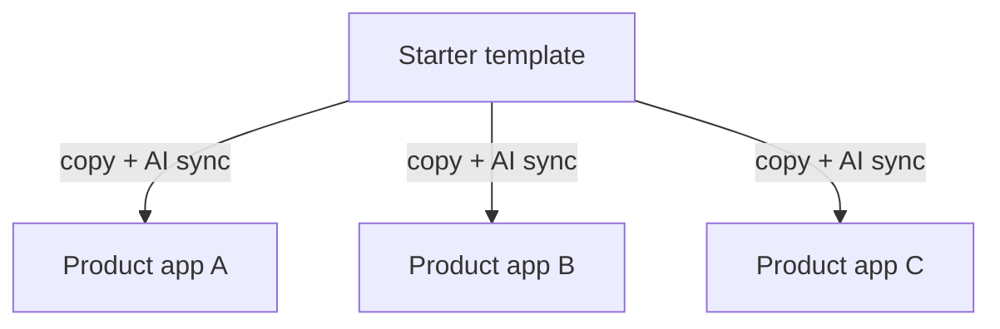
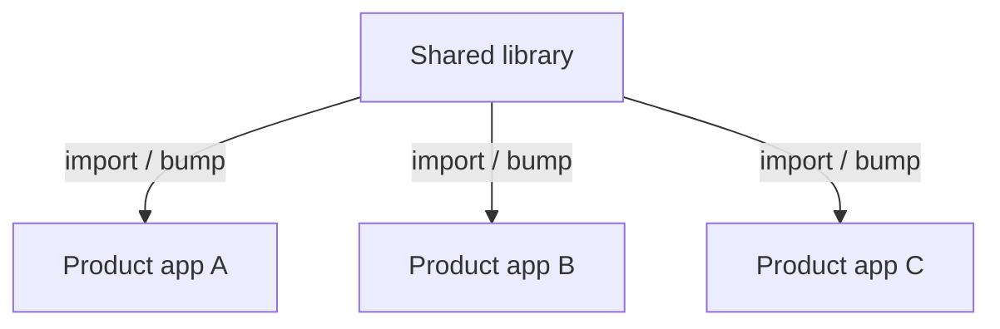
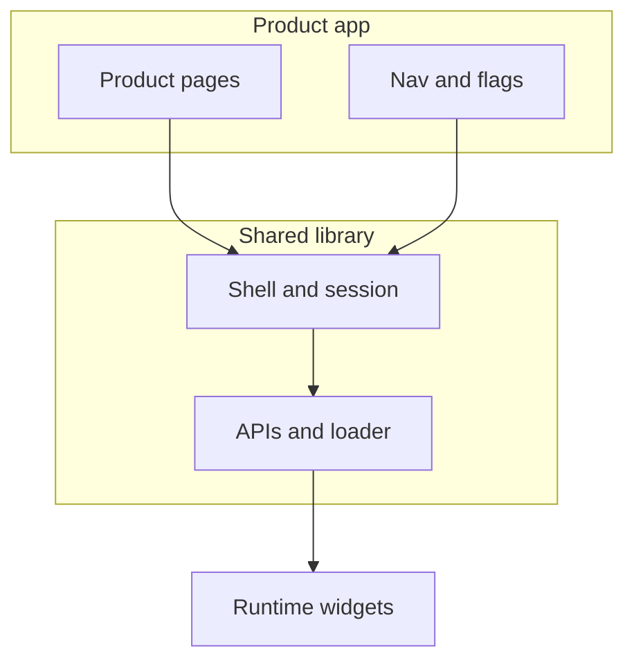
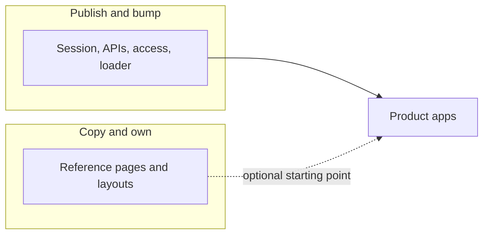

# Stop AI-syncing the starter. Extract a library.

For a while, our “platform” was a **starter repo**.

Every new product frontend began as a copy of the same template. Shell, routing, authentication, shared pages, state, translations — all of it lived in that template, and then it lived again in every copied application. When something in the chrome had to change, the plan was straightforward: fix it in the starter, then **sync the same change into every app**.

With AI, that sync got faster. The review did not.

You still ended up staring at thousands of lines of nearly identical diffs, in nearly identical files, across nearly identical apps — and you still had to check that nothing product-specific had been overwritten. That was the operating model. It was also the bottleneck.

I helped the team get out of it by extracting the shared code into a real library — published packages the apps could import instead of copy — in about a week. That week did not finish the platform. It made a platform possible. Everything since then has been about making that library good enough for **many product frontends**, so product teams ship product, and platform fixes land once.

```
  Before: the starter *was* the platform

              ┌──────────────┐
              │   Starter    │
              │  (template)  │
              └──────┬───────┘
                     │ copy once, then AI-sync forever
          ┌──────────┼──────────┐
          ▼          ▼          ▼
       ┌─────┐    ┌─────┐    ┌─────┐
       │ App │    │ App │    │ App │
       │  A  │    │  B  │    │  C  │
       └─────┘    └─────┘    └─────┘
          ▲          ▲          ▲
          └──────────┴──────────┘
           same chrome, N reviews
```



## The template was the platform

A skeleton is a good way to start. It is a bad way to *run* a fleet of production frontends.

Once each app had its own Git history, the copies stopped being copies. Login stayed similar until one product needed a custom page. Navigation drifted. A polyfill landed in three repos and not the others. Integration wiring got forked “just for this app.” The template was still the source of truth on paper. In practice, the source of truth was **whichever repo you happened to be in**.

The cost showed up as coordination, not as a single outage:

- A shell or auth fix was never one merge. It was a campaign.
- “Are we on the latest starter?” had no honest answer.
- The people who understood the chrome were reviewing the same change over and over, dressed up as a pull request per app.

That is a team problem, not a typing problem. AI does not fix it. AI **accelerates** it.

## Why “just sync with AI” made it worse

The original approach was: keep the starter canonical, then use AI to propagate updates into every app, then code-review the result.

On a small surface, that can work. On a full application — routing, bundler config, auth cookies, client state, translations, lazily loaded widgets — a “sync” is a huge, noisy diff. Reviewers cannot hold the product-specific bits and the platform bits in their head at the same time. You either rubber-stamp thousands of lines, or you become the bottleneck for every product.

Two failure modes showed up immediately:

1. **The sync overwrites the wrong thing.** An app had a legitimate customization. The next starter pass treated it as drift and stomped it.
2. **The sync does not overwrite enough.** A platform bugfix lands in the template and in some hosts, but not the ones that had already diverged too far for a clean patch.

So we were paying for AI generation *and* for human review of generated sameness, without getting a single shared runtime. Faster copying is not a platform.

The real question was: **what must exist once, and what may exist per product?**

Until that line existed, every sync was a guess.

## One week: cut the library out

I pulled the shared chrome out of the starter and into a **real library** — versioned packages hosts could depend on.

The first extraction was deliberately not a grand redesign. It was a cut:

- Put shell, APIs, state, UI, and shared pages behind package boundaries.
- Give each product app a dependency it could bump.
- Stop treating “edit the template and splat it everywhere” as the way platform work ships.

A week is enough to get a **real library in the repo, building, and usable** — not enough to migrate every host or invent every tool we have now. That distinction matters. The team did not need a perfect architecture document. They needed somewhere else to put the next shared fix besides twenty copies of `src/`.

That was the unlock. After that week, a platform change could be a version, not a code-sync ritual.

```
  After: one library, many hosts

         ┌─────────────────────────┐
         │     Shared library      │
         │  shell · session · APIs │
         │  UI primitives · loader │
         └───────────┬─────────────┘
                     │ import / version bump
          ┌──────────┼──────────┐
          ▼          ▼          ▼
       ┌─────┐    ┌─────┐    ┌─────┐
       │ App │    │ App │    │ App │
       │  A  │    │  B  │    │  C  │
       └─────┘    └─────┘    └─────┘
       product pages, nav, which integrations
```



## What that solved for the team

The immediate win was review load.

Instead of reading the same three-thousand-line AI sync in every product repo, engineers could review **one library change** and then a small host bump. Product-specific code stayed in the product repo. Shared behaviour stopped pretending to be product-specific.

It also changed who could help:

- Product teams could stay on product surfaces without re-implementing authentication, routing, or how third-party widgets load.
- Platform work stopped depending on whoever happened to remember which hosts were behind.
- The starter could shrink back toward what a starter should be: **structure**, not a second copy of the platform.

We still had fat hosts — applications that owned or forked chrome locally. Extraction did not magically thin them. It gave us a destination: import the shell, bootstrap, routing, and shared loader from the library. Keep navigation content, product pages, and which integrations are enabled in the app.

That destination is the customization boundary in one sentence: **if the next product would need the same change, it does not belong in the host.**

```
  What lives where (thin host)

  ┌──────────────────────────────────────────┐
  │  Product app                             │
  │  pages · nav content · feature flags     │
  │  which widgets to load                   │
  ├──────────────────────────────────────────┤
  │  Shared library                          │
  │  shell · auth / session · routing        │
  │  design primitives · how widgets load    │
  ├──────────────────────────────────────────┤
  │  Widgets loaded at runtime               │
  │  (host provides React; does not fork it) │
  └──────────────────────────────────────────┘
```



## The architecture that had to exist

Once the code lived in packages, the hard problems became visible. They were always there. The template had been hiding them inside copy-paste.

**Thin host vs fat host.** A thin app imports shared chrome from the library. A fat one still owns that chrome in-tree. New apps should be born thin. Existing ones migrate. You cannot pretend a starter template is a migration strategy.

**Old host, newer widgets.** The shell still had to run an older React on the host so existing federated widgets kept working, while newer UI expected newer APIs. That means one shared React instance, a few polyfills, and being strict about what the host bundles versus what it provides at runtime. This is not a footnote. It is the tax for keeping one platform across old and new UI.

**A version bump is not adoption.** Installing the latest shell package does not mean the host actually mounts it, wired the store, or stopped using a local copy of a shared page. We learned to treat “wired” as a separate step from “upgraded”: preview builds on a merge request, automated checks, and explicit notes so a bump includes the wiring, not only the version number.

**The starter is not allowed to become a second platform.** If we grow the starter every time something is shared, we are back to syncing. The template stays a snapshot of how to *start*. The library stays the place shared behaviour *lives*. Two starters is another sync.

None of that fitted in the first week. The week bought us the right place to solve it.

## After the week: keep making it fit the fleet

Extracting the library stopped the bleeding. It did not finish the job.

Since then I have stayed on this as the technical owner: not because the library should be a personal project, but because a multi-app platform still needs someone who will put the next shared thing in the shared place — and who will help the team move hosts toward that place instead of forking again.

That work looks like this in practice:

- **Thin-host migration** — move routing, widget hosting, polyfills, and token bootstrap into published packages; roll that model through live apps so product teams keep only product-specific surfaces.
- **Developer tooling** — a small CLI and agent kits so humans and coding agents can scaffold, validate, migrate, and upgrade hosts without another thousand-line sync.
- **Release trains** — versioning, a private registry, preview publishes, and upgrade flows so many hosts can take a platform change safely.
- **Shared chrome, not every shared-looking page** — shell, session, loaders, APIs, and design-system primitives belong in the library. We also published pages that looked universal. That ended the sync, then created a new wait: a UI fix in a product app still needed a platform bump. The next cut is a smaller library for contracts and capabilities; product pages stay a reference the app can copy and own.

```
  Keep the library small

  Publish / bump                         Copy once, then own
  ┌─────────────────────┐               ┌─────────────────────┐
  │  Contracts          │               │  Reference pages    │
  │  session, APIs,     │               │  settings, lists,   │
  │  access, loader     │               │  switchers, chrome  │
  └─────────────────────┘               └─────────────────────┘
           │                                      │
           ▼                                      ▼
     every app updates                    each app ships its
     on a version bump                    own UI fix
```



- **Analytics and observability** — one event catalogue and host-adoption rules, plus shared telemetry, so we are not inventing it once per app.

The CLI and the agents are easy to mistake for the architecture. They are the **interface**. If chrome still lives in each repo, a smarter sync still produces a smarter mess. The library is the architecture. The tools exist so the team can use it without waiting on one person to edit every host.

I still get asked to add “one more thing” to the platform. That is the job. The measure of success is not that I write every line. It is that the next product app does not need a special copy of the shell, and the next platform fix does not need a many-way AI review.

## What I would tell a team still syncing a template

If you have many product frontends and one starter repo, AI will make the wrong loop feel productive. You will generate the updates. You will spend your senior time reviewing them. You will still not have a single place where a bug dies for everyone.

Do the extraction even when it is imperfect. One week of a real library beats another quarter of synchronized forks.

Then draw the boundary in public, inside the team: what hosts may customize, what they must import, and how you will know a bump was actually adopted. Grow tooling after that, not before.

That is how we got from a skeleton that pretended to be a platform, to a library. The library stopped the many-way review. The next job is to keep it *small* — a bumpable unit for chrome and contracts — so product UI can live with the product again.
